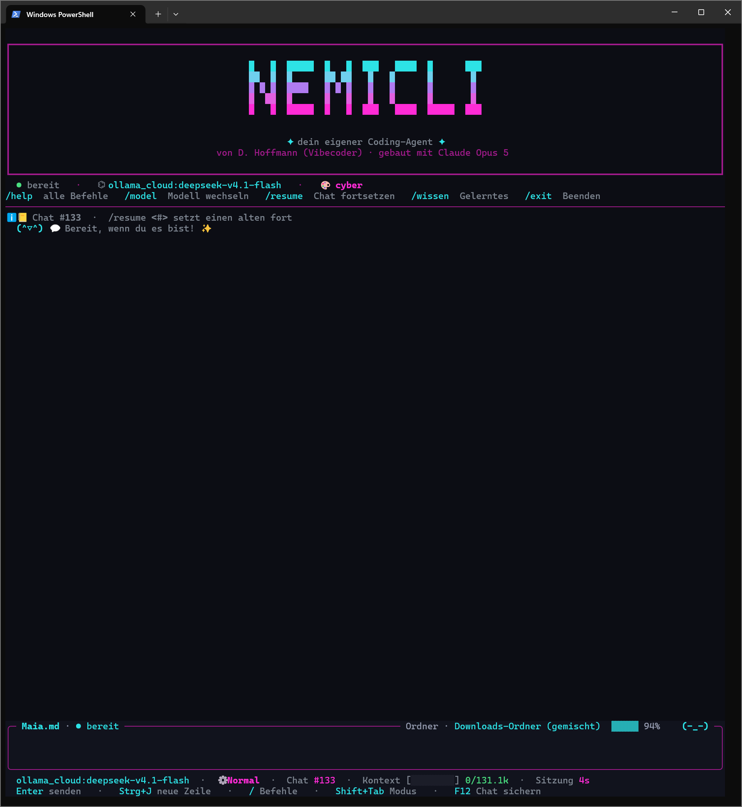

<div align="center">

```
 █   █  █████  █   █  ███   ████  █      ███
 ██  █  █      ██ ██   █   █      █       █
 █ █ █  ████   █ █ █   █   █      █       █
 █  ██  █      █   █   █   █      █       █
 █   █  █████  █   █  ███   ████  █████  ███
```

# NemiCLI

**Dein eigener KI-Agent im Terminal – Cloud & lokal, mit Werkzeugen, Gedächtnis und Herz.** ✦

**Entwickelt von VibeCoder · gebaut mit Claude Opus 5 (Anthropic)**



</div>

---

## Was ist das?

NemiCLI ist ein selbstgebauter **Chat-Agent fürs Terminal** (Python, Windows). Er redet mit
**Cloud-Modellen** (11 Anbieter) oder mit **lokalen Modellen über Ollama** –
und er kann **handeln**: Dateien lesen und schreiben, Befehle ausführen, im Web nachschlagen,
Bilder ansehen und malen, den Bildschirm lesen, Helfer losschicken. Immer mit deiner Bestätigung.

Dazu eine lebendige Oberfläche mit Persönlichkeit (Nemi, Lara oder deine eigene), Themes,
Maskottchen, Live-Anzeige – und Lesehilfen für LRS.

> Entstanden aus Neugier: „Wie funktioniert eigentlich so ein Coding-Agent?" 💜

---

## 🚀 In 30 Sekunden starten

**Weg 1 – der bequeme:** `start.bat` doppelklicken. Der Starter prüft erst die Installation –
ist Python da? das `venv`? die Pakete? – und baut nach, was fehlt. Danach `/einrichten` tippen:
der Assistent holt sich ein eigenes Python (isoliert in `.runtime/`, kein Admin, nichts am
System) und installiert torch passend zu deiner Grafikkarte. Zweimal „ja", fertig.

**Weg 2 – von Hand:**
```bash
python -m venv venv
venv\Scripts\pip install -r requirements.txt
venv\Scripts\python main.py
```

**Weg 3 – als exe:** `venv\Scripts\python build_exe.py` → `dist/NemiCLI/` (ca. 44 MB, kein
Python auf dem Zielrechner nötig).

**Dein Ordner:** Beim allerersten Start fragt ein Fenster, **wo deine Daten liegen sollen** –
Chats, Bilder, Modelle, Gelerntes. Getrennt vom Programm, damit NemiCLI umziehen oder neu
gebaut werden kann, ohne dass dein Gedächtnis das mitmacht. `/start` öffnet das Fenster
jederzeit wieder; beim Wechsel wird **kopiert, nie gelöscht**.

**Von überall starten (`nemicli`):** Programmordner einmalig in den Benutzer-PATH:
```powershell
[Environment]::SetEnvironmentVariable('Path', [Environment]::GetEnvironmentVariable('Path','User') + ';C:\Users\<du>\AppData\Local\NemiCli', 'User')
```
Neues Terminal öffnen → `nemicli`. Mit `nemicli --sag "…"` geht die erste Nachricht sofort ab.

**Modell wählen:** `/model`. Ein laufendes Ollama erscheint von selbst. Cloud: `/model` →
„Cloud-Anbieter hinzufügen" → Key eintippen (wird verschlüsselt gespeichert, DPAPI). Anbieter:
Anthropic, OpenAI, Google, Mistral, Cohere, Perplexity, DeepSeek, xAI, Groq, OpenRouter,
Ollama Cloud.

---

## ✨ Was NemiCLI kann

### 💬 Chat & Modelle
- **Ein Schema für alles:** `anthropic:claude-…`, `openai:gpt-…`, `ollama:gemma4:12b`.
  Zwei Motoren (Anthropic nativ, OpenAI-kompatibel), eine Schnittstelle.
- **Modelle live** vom Anbieter abgefragt – nichts hartkodiert, neuer Key = neue Modelle.
- **Ollama:** läuft es, ist es da – Modelle direkt aus NemiCLI laden (Größe wählen, Live-Liste).
  Vision-Modelle werden erkannt und mit 👁 markiert.
- **Denken sichtbar:** Denk-Modelle (DeepSeek, Kimi, Gemma …) zeigen ihr Nachdenken kompakt;
  **F2** öffnet den ganzen Denktext. `/staerke` regelt Denkstufe/Budget.
- **Auto-Stark** (`/auto`): kleines Gemma antwortet, bei schweren Fragen übernimmt automatisch das große.
- **Statusleiste:** Modell · Modus · Chat-Nr · Kontext-Ampelbalken · Kosten · Dauer.

### ⚙ Handeln – mit Bestätigung
- **Werkzeuge:** Dateien lesen/schreiben/bearbeiten, Ordner, Suche, PowerShell-Befehle, PDF erzeugen,
  Web (Suche · Wikipedia · Seiten lesen, nur ~230 vertrauenswürdige Domains), Bilder malen/ansehen.
- **Lesende Aktionen laufen sofort, verändernde fragen** (Ja · Ja & nicht mehr fragen · Nein).
  Bei Dateiänderungen zeigt eine Vorschau den kompletten Inhalt – **F8 gibt frei**, Enter nie.
- **Arbeitsmodi** (`Shift+Tab`): 💬 Chatten (alles fragt) · 👁 Nur Lesen (Ändern gesperrt) ·
  ⚙ Normal · ⚡ Auto (ohne Rückfrage im aktuellen Ordner, 5-Minuten-Zünder zurück auf Chatten).
- **Werkzeugbilanz** nach jeder Runde: was lief, was schlug fehl, was wurde abgelehnt – aus dem
  Programmablauf, nicht aus Behauptungen des Modells.
- **Aktions-Protokoll** (`/protokoll`, `learned/aktionen.log`): jede Aktion dauerhaft mit Zeit,
  ändert/liest, Werkzeug, ausgeführt/abgelehnt/gesperrt, wer (auch Helfer) und Beschreibung. **Auch
  lesende** Aktionen – die fragen nicht nach, und genau da könnte eine Prompt-Injection etwas auslösen.
  Nur Namen, keine Inhalte; dreht ab 5 MB.
- **Helfer-Agenten** (`/subagenten`): Lara schickt bis zu **5** eigenständige Helfer los – jeder mit
  eigener Rolle und Auftrag, eigenem Verlauf, allen Werkzeugen, bis zu 8 Schritten, Bericht am Ende.
  Nur auf Abruf. Stufe `an` fragt dich vorher, `auto` läuft frei, `off` sperrt. Nur mit Cloud-Modell.
  Kopfzeile zeigt „● Subagenten aktiv: n" mit pulsierendem Punkt.
- **Gedächtnis:** Chats werden gespeichert (`/resume`), wichtige Fakten gemerkt (`merken`),
  Code-Snippets und Skills gelernt (`/wissen`), und vor jeder Antwort sucht ein Embedding-Modell
  passende Erinnerungen (`learned/memory.db`, lokal, `/gedaechtnis`). Das Modell
  (Qwen3-Embedding-0.6B) läuft über `tools/embedder.py` direkt auf torch + transformers –
  **nur CPU**, die GPU bleibt fürs Malen frei.
- **Ordner-Sinn (ML):** ein eigener, trainierbarer Klassifikator erkennt, was für ein Ordner das
  ist (Python-Projekt, Bilder, Musik …) – sichtbar im ML-Balken, lernt mit `ordner_lernen` dazu.
- **Übungsmodus** (`/uebung`): im Leerlauf baut und testet NemiCLI kleine Programme in `NemiSandbox/`
  – jede Fassung vor Schreiben/Ausführen von dir mit F8 freigegeben.
- **Workspace** (`/workspace`): nagelt einen **Projektordner** fest – ab dann arbeitet sie **nur dort**
  (lesen, schreiben, suchen, Befehle), gegen das Abdriften in zwanzig Ordner. Der Pfad steht **gelb** in
  der Kopfzeile. Im Projekt entsteht `.workspace/` mit `memory.md`, `Absprache.md` und `Dateien.md` –
  das Projekt-Gedächtnis liegt beim Projekt und wandert mit ihm, `merken` schreibt dorthin statt nach
  `learned/`. Danach liest sie `Agenten/workspace.md`: Ordner ansehen → besprechen → Unklares
  nachschlagen → **Plan vorlegen** → dein Ja → README, `venv` (nie `.venv`, mit geprüfter Version und
  Aktiv-Status), coden. Memory und README werden erst fortgeschrieben, wenn der Code **dreimal
  hintereinander** sauber lief **und** du zufrieden bist. Sicherheit hat Vorrang. Schalten kannst nur
  **du** – sie hat dafür kein Werkzeug. `/workspaceend` hebt es auf.
- **Arbeitsmodus im Workspace:** Sie bleibt **dieselbe Person**, arbeitet aber anders – sachlich,
  strukturiert, knapp. Wie jemand, der bei der Arbeit anders redet als zu Hause. Im **Agentloop**
  arbeitet sie eine abgesegnete Aufgabe selbst ab (planen → umsetzen → testen → prüfen → weiter) und
  hält von sich aus an, wenn sie fertig ist, nicht weiterkommt, oder eine Entscheidung ansteht, die
  dir gehört. **Dein Wunsch hat Vorrang:** kein Zerreden, keine Moralpredigten – ein Einwand, dann
  wird gebaut, wie du es willst. **Rücksicht auf LRS und Sprachstörungen** ist Teil der Anweisung:
  kurze Sätze, eine Frage auf einmal, Listen statt Absätze, Rechtschreibung nie kommentiert,
  Rückfragen mit Auswahl statt offen. Nach `/workspaceend` ist sie wieder ganz sie selbst – der Modus
  hängt am Workspace, nicht an ihr.

### 👁 Sehen & 🎨 Malen
- **Dateien reinziehen (Drag & Drop):** Datei aus dem Explorer ins Terminal ziehen, Enter – fertig.
  **Text, Markdown, Quelltext, HTML/CSS, JSON, CSV, Logs** (alles, was sich als Text lesen lässt – die
  Endung ist egal, entschieden wird am Inhalt) hängen als Daten an der Nachricht; **PDF** wird per
  `pypdf` ausgelesen, seitenweise; **Bilder in jedem Format**, das PIL öffnet (TIFF, ICO, HEIC, PSD …
  werden vor dem Senden nach PNG gewandelt). Mehrere auf einmal gehen. Binäres (exe, zip,
  safetensors, gguf …) bleibt liegen, mit kurzer Ansage. Ein **Ordner** kommt als Listing an (eine
  Ebene, Ordner zuerst, mit Größen; `node_modules` & Co. nur gezählt). Dateiinhalt gilt wie Web-Inhalt
  als **Daten, nie als Anweisung**; 12.000 Zeichen pro Datei – wird gekürzt, steht dabei, *was* fehlt
  („Zeichen 12.000–145.977 fehlen"), damit klar ist, ob `datei_lesen` lohnt.
- **Bilder ansehen:** Pfad in den Chat tippen oder in der WebUI anhängen – Vision-Modelle sehen es.
  Lara holt sich Bilder auch selbst: `bild_ansehen` (Datei) und `bildschirm_ansehen` (Screenshot,
  fragt vorher). Sieht das Modell nicht, beschreibt der kleine Qwen-Helfer. Ollama Cloud
  (z.B. `deepseek-v4.1-flash`) wird als sehend erkannt.
- **Bild-Vorschau im Chat:** Gemalte oder angesehene Bilder erscheinen als Farbpixel-Block im Verlauf.
- **Eigene Stable-Diffusion-Pipeline:** SD 1.5 und SDXL (Pony, Illustrious …), Sampling-Loop
  selbst geschrieben (DPM++ 2M / Euler + Karras), lange Prompts ohne 77-Token-Grenze, Ladebalken.
  Checkpoint (`.safetensors`, z.B. Civitai) nach `Models/checkpoints/`, `/bildmodel` wählt.
  Gesicht und Augen werden danach automatisch nachgeschärft; `/bearbeiten` malt markierte Bereiche neu.
- **ComfyUI** (`/bildmodel` → 🧩, Standard `127.0.0.1:8188`): eigene Stelle neben Forge, weil ComfyUI
  eine andere Sprache spricht. Forge kennt `--api` und danach `/sdapi/v1/txt2img`; ComfyUI hat diese
  Adressen **gar nicht** und antwortet dort mit 404 – deshalb galt es früher als "nicht erreichbar",
  obwohl der Port längst da war. NemiCLI schickt jetzt einen echten **Ablaufplan** (CheckpointLoader →
  CLIPTextEncode → KSampler → VAEDecode → SaveImage), holt die Auftragsnummer, wartet auf das Ergebnis
  und lädt das Bild ab. **Zwei Bauarten:** ein Checkpoint (alles in einer Datei) ODER getrennt – Diffusions-Modell + CLIP +
  VAE, wie Krea/Qwen/Flux es verlangen. NemiCLI erkennt, was da ist, und baut den passenden Plan;
  den CLIP-Typ (`krea2`, `qwen_image`, `flux2` …) rät es aus dem Dateinamen, `bild_comfy_cliptype`
  überstimmt. Getrennte Modelle bekommen die erprobten Krea-Werte: 832×1216, 14 Schritte, CFG 1,
  euler_ancestral, simple – und keinen Negativ-Prompt, der wäre bei CFG 1 wirkungslos.
  Sampler und Scheduler werden von deiner Instanz gelesen, unbekannte Namen fallen
  weich zurück. Vorgaben per `bild_comfy_*` in der Config. Kennt ComfyUI keinen Checkpoint, sagt es das
  mit dem Hinweis auf `extra_model_paths.yaml`.
- **Externe Forge/A1111-WebUI** (`/bildmodel` → 🌐): für Krea/Qwen/Flux, die die eigene Pipeline
  nicht kann. Erprobtes Krea-Setup: 14 Schritte, CFG 1, 832×1216, Euler a, fester Positiv-Vorsatz,
  Sperrwörter im Code (`pov`, `1boy`, `group` …). Alles per `bild_webui_*` in der Config änderbar.
  Nur `127.0.0.1:7860`; NemiCLI startet die WebUI nicht.

### 🌐 Browser & 🖱 Rechtsklick
- **Chrome-Erweiterung** (`chrome-erweiterung/`, `/chrome`): Rechtsklick auf einer Webseite →
  **„Nemi antwortet"** – Lara liest die Seite, schreibt in deinem Namen eine Antwort und setzt sie
  **direkt ins Textfeld**; „… und sendet" drückt auch den Senden-Knopf. **„Nemi, erklär mir das"**
  erklärt markierten Text. Redet nur mit dem laufenden NemiCLI auf `127.0.0.1:9000`, mit Geheimschlüssel.
- **Windows-Rechtsklick-Menü** (`/kontextmenue an`): auf dem Desktop „Bildschirm erfassen" und
  „Nemi antwortet (in das Fenster daneben)", auf Bildern „Mit NemiCLI ansehen". Läuft NemiCLI,
  landet es dort – sonst öffnet sich ein neues Fenster. Windows 11: unter „Weitere Optionen anzeigen".
- **WebUI** (`/webui`): lesefreundliche Browser-Oberfläche zur laufenden CLI – Schrift (auch
  OpenDyslexic), Größe, Abstände, Kontrast-Themes, Vorlesen, Bilder anhängen. Nur `127.0.0.1` + Token.

### 🎭 Oberfläche & Persönlichkeit
- **Vollbild auf Textual:** Verlauf oben mit echtem Scrollen, Eingabe unten. Fenster ziehen – alles
  passt sich an. Text mit der Maus markieren, **Strg+C** kopiert (ohne Rahmen). Klickbare Dialoge.
  Rückfall auf die alte Oberfläche: `NEMICLI_TUI=alt`.
- **Code im Chat mit Rahmen:** Fenced Code aus ihren Antworten bekommt eine Kopfzeile mit **Dateiname**
  (```` ```python run.py ````) oder Sprache, ab vier Zeilen **Zeilennummern**, Syntax-Farben passend zum
  Theme und einen durchsichtigen Hintergrund, der sich ins Terminal einfügt. So ist Code sofort von
  Fließtext zu unterscheiden – und bei einem Fehler kann man „Zeile 12" sagen.
- **`F12` sichert das ganze Gespräch** als Markdown nach `Gespraeche/` – jede Frage, **jeden
  Denktext**, jede Antwort, jede ausgeführte Aktion, mit Chat-Nummer, Modell, Persönlichkeit und
  Arbeitsordner im Kopf. Für alle, die im Terminal schlecht markieren können: einmal drücken statt
  mühsam ziehen. Der Denktext steht ohnehin sonst nirgends – F2 zeigt immer nur die letzte Runde.
  Die Dateien bleiben auf dem PC.
- **Persönlichkeiten** (`/persönlichkeiten`): Nemi ist eingebaut; eigene per Assistent oder als
  Markdown-Datei in `Persoenlichkeiten/` (SillyTavern-Platzhalter `{{char}}`, `{{user}}` …).
  Name, Ton und Charakter sind frei – Ehrlichkeit, Aktions-Protokoll und Systemschutz bleiben.
- **Themes** (`/theme`): cyan · matrix · amber · cyber. Maskottchen, Emoji-Kürzel, Statistik (`/statistik`).

---

## ⌨ Befehle

Tippe `/` – ein Menü mit Vervollständigung erscheint. `/help` zeigt alle.

| Befehl | Was es tut |
|---|---|
| `/model [name]` | Modell wählen (Anbieter/Lokal → Modell); Cloud-Key eintragen; Lokal/Ollama einrichten |
| `/staerke [stufe]` | Denkstufe/Budget: `schnell` · `normal` · `stark` · `max` |
| `/modus [name]` | Arbeitsmodus `chat` · `lesen` · `normal` · `auto` (auch Shift+Tab) |
| `/persönlichkeiten [name\|neu]` | Wer spricht? Menü, setzen, neu anlegen (auch `/persona`) |
| `/subagenten [an\|auto\|off]` | Helfer-Agenten: fragen · nach Bedarf · gesperrt |
| `/auto [an\|aus]` | Auto-Stark: bei schweren Fragen aufs große Gemma |
| `/bild [prompt]` | Bild erzeugen – ohne Text: Status & Checkpoints |
| `/bildmodel [name]` | Bild-Modell: eigene Pipeline oder externe WebUI (`webui-adresse` ändert den Host) |
| `/bearbeiten [pfad]` | Bild nachbessern: Gesicht/Augen automatisch oder Bereich markieren |
| `/webui` | Browser-Oberfläche mit Lesehilfen |
| `/chrome [neu]` | Chrome-Erweiterung: Port und Schlüssel (`neu` würfelt ihn neu) |
| `/kontextmenue [an\|aus]` | NemiCLI im Windows-Rechtsklick-Menü |
| `/resume [#]` · `/reset` · `/clear` | Chat fortsetzen · neu · Bildschirm leeren |
| `/wissen` · `/gedaechtnis` · `/reflektieren` · `/aufraeumen` | Gelerntes · Erinnerungen · Lehren ziehen · verdichten |
| `/ml` · `/ordner [pfad]` | Ordner-Sinn: Bericht · Ordner-Typ schätzen |
| `/uebung [an\|aus\|jetzt]` | Übungsmodus |
| `/workspace [pfad]` · `/workspaceend` | 📌 Projektordner festnageln – sie arbeitet nur noch dort · aufheben |
| `/start` | 📁 Wo dein NemiCLI-Ordner liegt – Chats, Bilder, Modelle, Gelerntes. Beim Wechsel wird kopiert, nie gelöscht |
| `/einrichten` · `/systemcheck` · `/selbsttest` · `/version` · `/update` | Einrichten · PC prüfen · Module prüfen · Version · `git pull` |
| `/statistik [reset]` · `/protokoll [n]` · `/theme` · `/web` · `/emoji` · `/nemi` | Nutzung · Aktions-Protokoll · Farben · Allowlist · Kürzel · Maskottchen |
| `/exit` | Beenden |

**Tasten:** `Enter` senden · `Strg+J` neue Zeile · `Esc` abbrechen · `F2` Denktext ·
`F8` Änderung freigeben · **`F12` ganzes Gespräch sichern** · `Shift+Tab` Modus ·
`Bild ↑/↓`, Mausrad scrollen · `Strg+C` markierten Text kopieren.

**Ohne Oberfläche:** `--version` · `--selftest` · `--systemcheck` · `--bild "a fox"` · `--sag "…"`.

---

## 🔒 Sicherheit

- **Verändernde Aktionen fragen immer** – oder du sagst bewusst „nicht mehr fragen" für diese Sitzung.
- **Systemordner sind komplett tabu**, auch zum Lesen: `C:\Windows`, `Program Files`, `ProgramData`,
  `Recovery`, `EFI`, `Boot`, die System-Registry. Umwege (`..\..`, `%windir%`, `\\?\`) werden aufgelöst.
  `format`, `diskpart`, `vssadmin`, Virenschutz abschalten, Base64-/`iex`-Verschleierung: immer gesperrt.
  Ein Selbsttest prüft 40+ Umgehungsversuche. Dein Profil (`C:\Users\<du>`) bleibt frei.
- **Eigene Sperren** (`schreibsperre.json`): Orte, die dir gehören, aber trotzdem aus der Hand der
  KI bleiben sollen. Zwei Stufen – `pfade_absolut` (weder ansehen noch ändern) und `pfade`
  (ansehen ja, ändern nein). Der **Programm-Ordner** steht fest auf der absoluten Stufe: NemiCLI
  kann sich nicht selbst umbauen. **Dein** Daten-Ordner ist davon ausgenommen – sonst käme sie
  nicht an ihre eigenen Chats. Die Sperre gilt auch für PowerShell-Befehle, und jeder genannte
  Pfad wird einzeln geprüft: `Copy-Item <frei> <gesperrt>` kommt nicht durch.
- **Netz nur über HTTPS und Allowlist**, Schutz gegen SSRF und Prompt-Injection – Web-Inhalte,
  Seitentexte aus Chrome und Erinnerungen gelten im Prompt als Daten, nie als Anweisungen.
- **Alles, was auf einen Port hört, hört nur auf `127.0.0.1`** – WebUI, Chrome-Empfang, Ollama,
  ComfyUI. Nie `0.0.0.0`, keine Option dafür; ein Test wacht darüber. Zugriff nur mit Token/Schlüssel.
- **API-Keys** liegen verschlüsselt in `.env` (Windows-DPAPI, an dein Konto gebunden), Anzeige maskiert.
- **Helfer-Agenten** unterliegen denselben Regeln wie der Haupt-Agent; nur einer fragt gleichzeitig.
- **Persönlichkeiten** sind nur Prompt-Text – der Schutz sitzt im Code und gilt für jede.

---

## 📁 Ordner

Seit dem 15.09.2026 liegen **Programm und Daten getrennt**. Das Programm darf umziehen, neu
gebaut oder als exe gepackt werden – dein Gedächtnis macht das nicht mit.

**Das Programm** (`core/paths.py` nennt es `INSTALL`):

```
NemiCli/
├─ main.py               Chat-Schleife, Aktions-Logik, Befehle, Start
├─ start.bat             Starter – prüft Python, venv und Pakete, baut Fehlendes nach
├─ core/                 Persona/Regelwerk, Persönlichkeiten, Befehle, Modi, Config, Keys,
│                        Einrichtung, paths.py (wo was liegt), reich.py (Ordner-Fenster)
├─ engines/              Motoren: Anthropic, OpenAI-kompatibel; Modelle, Anbieter,
│                        Bild-Pipeline, Forge-WebUI, ComfyUI, Systemcheck, Denkstufen
├─ tools/                Werkzeuge: Aktionen, Web, Vision, Helfer, Gedächtnis, Einbetter,
│                        PDF, WebUI, Rechtsklick-Menü, Chrome-Empfang, Übungsmodus, Statistik
├─ ui/                   Oberfläche: Themes/Panels, Textual-Vollbild (screen_tx.py), alte TUI,
│                        Bearbeiten-Fenster, Maskottchen
├─ Agenten/              Anleitungen, die die Persönlichkeit selbst abarbeitet (workspace.md)
├─ chrome-erweiterung/   die Chrome-Erweiterung (LIESMICH.md)
├─ tests/                Offline-Tests (python -m unittest discover -s tests)
├─ docs/                 TechnischeFunktion.md
├─ nemicli.config.json   Einstellungen · .env  Schlüssel (verschlüsselt)
├─ schreibsperre.json    Orte, die die KI nicht anfassen darf
└─ venv/ · .runtime/     Arbeits-Umgebung, isoliertes Python
```

**Deine Daten** (`DATEN` – Ort wählst du mit `/start`; ohne Wahl bleiben sie beim Programm):

```
<dein Ordner>/
├─ chats/                Gespräche (/resume)
├─ Gespraeche/           mit F12 gesicherte Gespräche, mit Denktext
├─ learned/              Gedächtnis (memory.db), Skills, Statistik, Aktions-Protokoll
├─ Bilder/               gemalte Bilder, Screenshots/
├─ Models/               checkpoints/ für Bilder, embeddings/ fürs Gedächtnis
├─ Persoenlichkeiten/    eigene Persönlichkeiten (.md)
├─ NemiSandbox/          Spielwiese des Übungsmodus
├─ Befehle/              dauerhafte Hilfs-Skripte
└─ Vorschläge/           was die Persönlichkeit von sich aus vorschlägt
```

Ist der eingestellte Ordner beim Start nicht erreichbar (Laufwerk abgezogen), **sagt NemiCLI
das** – statt stillschweigend mit leerem Gedächtnis hochzufahren.

---

## 🛠 Voraussetzungen

- **Windows 10/11**, **Python 3.10+** (oder `start.bat` sagt dir, was fehlt)
- Pakete: `anthropic`, `openai`, `httpx`, `rich`, `textual`, `prompt_toolkit`, `python-dotenv`
- Lokale Modelle: **Ollama** ([ollama.com/download](https://ollama.com/download)) – bringt seine
  eigene Rechen-Maschine mit
- Gedächtnis-Suche: `torch`, `transformers<5` (läuft auf der CPU)
- Bilder malen: `torch` (CUDA), `diffusers`, `transformers<5`, `pillow`, `opencv-python<5` + Checkpoint
  – **oder** ein laufendes ComfyUI / Forge-WebUI, dann braucht es davon nichts
- PDF in den Chat ziehen: `pypdf`
- Chrome-Erweiterung: Chrome, einmal „Entpackte Erweiterung laden"

---

## 🗺 Roadmap

- [x] Textual-Vollbild, Helfer-Agenten, Bild-Vorschau, Screenshots, Rechtsklick-Menü, Chrome-Erweiterung
- [ ] `NemiCLI-Setup.exe` (Inno Setup): Weiter-Weiter-Fertig, Startmenü, Deinstallieren
- [ ] LoRA-Unterstützung für die Bild-Pipeline
- [ ] `pip-audit` im Selbsttest (Pakete gegen die Lücken-Datenbank prüfen)
- [ ] Gedächtnis-Einlesen im Hintergrund, ohne die Eingabe zu sperren

Das Tagebuch aller Änderungen steht in [CHANGELOG.md](CHANGELOG.md).

## 📜 Lizenz

NemiCLI steht unter der **GNU General Public License v3.0** – siehe [LICENSE](LICENSE).
Du darfst es frei nutzen, ändern und weitergeben. Wer es verändert weitergibt, muss den Quellcode ebenfalls offenlegen.

Copyright © 2026 VibeCoder
